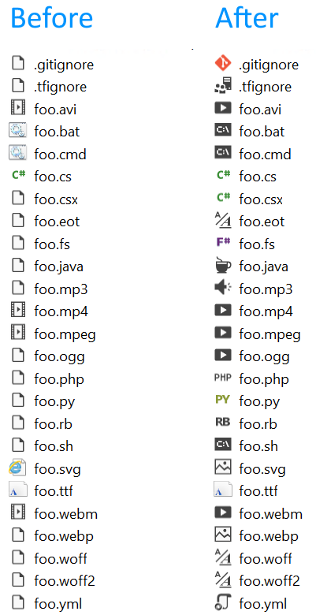

# File Icons

Download this extension from the [VS Gallery](https://visualstudiogallery.msdn.microsoft.com/5e1762e8-a88b-417c-8467-6a65d771cc4e)
or get the [CI build](http://vsixgallery.com/extension/3a7b4930-a5fb-46ec-a9b8-9610c8f953b8/).

---------------------------------------

Adds icons for files that are not recognized by Solution Explorer

See the [change log](CHANGELOG.md) for changes and road map.

## Solution Explorer
This extensions adds file icons to Solution Explorer for files that
Visual Studio doesn't provide icons for.

Check out the
[full list of file icons](https://github.com/madskristensen/FileIcons/blob/master/src/icons.pkgdef)
supported by this extension.

## Suggest new icons
If you find any icons missing, please open an issue or send a pull
request on the [GitHub repo](http://https://github.com/madskristensen/FileIcons). All known icons and their associated monikers can be found [here](http://glyphlist.azurewebsites.net/knownmonikers/).

## Contribute
Check out the [contribution guidelines](.github/CONTRIBUTING.md)
if you want to contribute to this project.

For cloning and building this project yourself, make sure
to install the
[Extensibility Tools 2015](https://visualstudiogallery.msdn.microsoft.com/ab39a092-1343-46e2-b0f1-6a3f91155aa6)
extension for Visual Studio which enables some features
used by this project.

## License
[Apache 2.0](LICENSE)