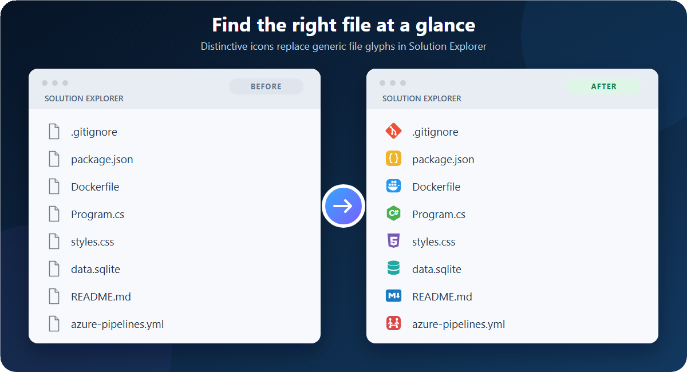
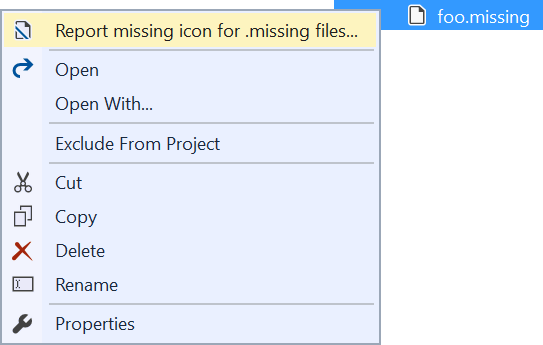

[ci-build]: <https://www.vsixgallery.com/extension/3a7b4930-a5fb-46ec-a9b8-9610c8f953b8/>

# File Icons for Visual Studio

[](https://github.com/madskristensen/FileIcons/actions/workflows/build.yaml)
[][ci-build]


Make files easier to recognize in Solution Explorer.

File Icons adds distinctive icons for hundreds of file types that Visual Studio would otherwise display with a generic or misleading icon. It works automatically after installation and requires no configuration.



## Highlights

- Covers programming languages, configuration files, build systems, templates, databases, documents, and more.
- Reuses native Visual Studio icons whenever an appropriate one exists.
- Includes carefully sourced custom artwork for formats not covered by the Visual Studio image catalog.
- Supports Visual Studio 2022 17.14 and later on AMD64 and ARM64.
- Adds no editor features, background analysis, or project-system behavior.

Browse the [complete list of supported file extensions](FileExtensions.md).

## Install

Install **File Icons** from the [Visual Studio Marketplace](https://marketplace.visualstudio.com/items?itemName=MadsKristensen.FileIcons).

Preview builds are also available from [Open VSIX](https://www.vsixgallery.com/extension/3a7b4930-a5fb-46ec-a9b8-9610c8f953b8/).

Restart Visual Studio after installing or updating the extension so all icon associations are loaded.

## Request an icon

Right-click an unrecognized file in Solution Explorer and select **Report missing icon**. The command appears only when the selected file type has no registered icon.



You can also submit an [icon request on GitHub](https://github.com/madskristensen/FileIcons/issues/new?template=icon_request.yml). Before opening a request:

1. Check the [supported extensions](FileExtensions.md).
2. Search existing issues.
3. Verify that the latest Visual Studio release does not already provide an icon.
4. Link to the official file format and, when possible, an authoritative SVG icon with clear redistribution terms.

## Contribute

Icon associations and artwork are defined in [`catalog.json`](catalog.json). The generated package files and extension list should not be edited by hand.

Read the [contribution guidelines](CONTRIBUTING.md) for artwork, licensing, and Visual Studio image catalog requirements.

To build locally:

1. Open `FileIcons.slnx` in Visual Studio 2022 or later.
2. Build the solution. Required VSSDK packages are restored automatically.
3. Press `F5` to test the extension in the Visual Studio experimental instance.

After changing `catalog.json`, regenerate the package artifacts:

```powershell
pwsh -NoProfile -File .\tools\Generate-Catalog.ps1
```

The build verifies that generated files are current, monikers are valid, custom image IDs are unique, assets are referenced, and required source and license metadata is present.

## Maintenance

Maintainers can rank coverage gaps from an aggregate telemetry export without adding that export to the repository:

```powershell
pwsh -NoProfile -File .\tools\Get-TelemetryCoverage.ps1 -CsvPath <path-to-csv>
```

## Credits and license

File Icons is licensed under the [Apache License 2.0](LICENSE). Some artwork originated in the [vscode-icons](https://github.com/vscode-icons-team/vscode-icons) project. See [Third-Party Notices](THIRD-PARTY-NOTICES.txt) for attribution and license details.
